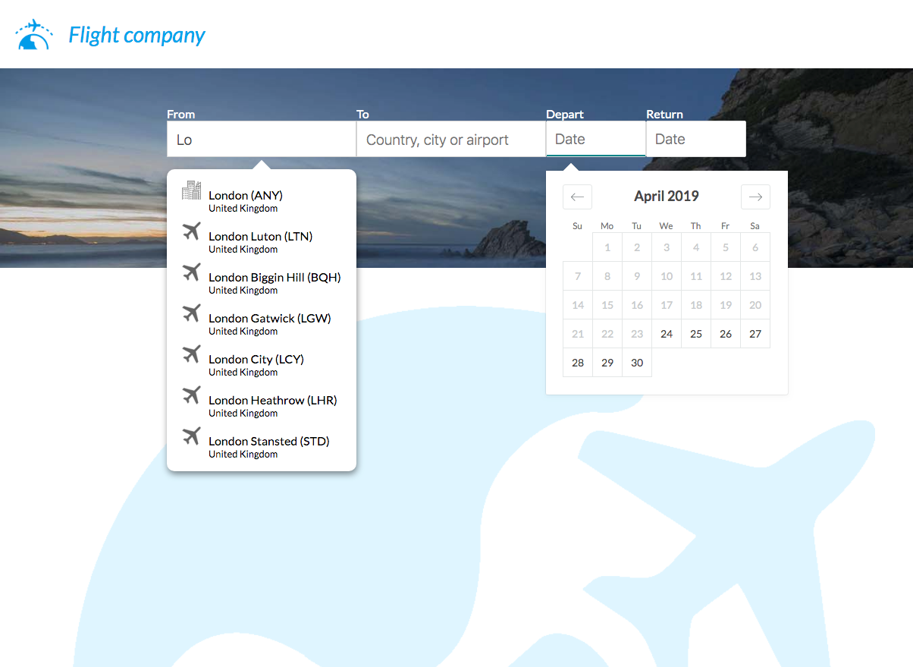
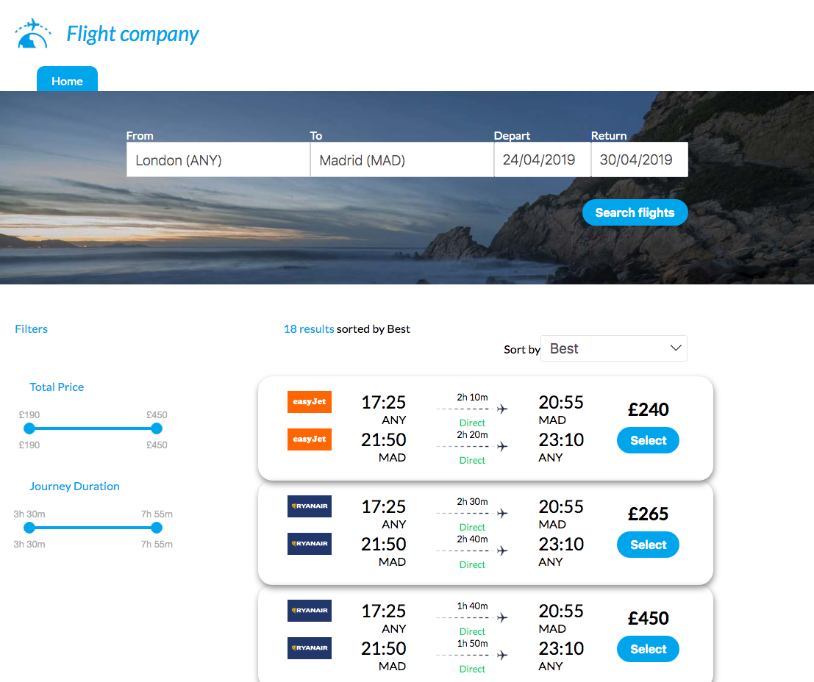

# Flight Company -  flight search website

<p align="center">
  
</p>

## General considerations 

I´ve decided code the solution using React/Redux with Redux-Thunk as a middleware as a main technologies and NextJS as a boilerplate.

All the tests can be found in the folder: "__tests__"
The Server code can be found in the folder: "server"
All the components in the folders: "components" and "pages"
Config files in the folder: "config"
All the actions/Reducers are defined in the file "store.js"
For the CSS/style I´ve used SASS / Sytle-JSX / CSS Flexbox

The system has three pages:

* /  Home  page, where you can introduce the search data (From, To, Depart, Return)
* /results page, similar functionality that the home page, but also shows the results of your search
* generic 404 page


There are only 3 city airports availables for testing

London, Barcelona and Madrid

I´ve tried to use as a guideline the Skyscanner page, which means:

* In the search box, we need to click in the airport inside of the popup to choose it.
* Same for the dates, is necessary click in the day, is not possible introduce it manually with the keyboard.
* You can´t use a return date earlier than the depart date (an error message will appear)
* The results can be filter by "Total Price" or "Journey Duration"
* You can show the results in order (by price, duration or without order)

<p align="center">
  
</p>


## Front End

For the FrontEnd the System is using:

React
Redux
Redux-Thunk
Next
Prop-Types
React-Input-Ranges
Express


And for the styling:  SASS / Sytle JSX / CSS Flexbox

## Back End

In the backend is running a dummy Node server (http://localhost:9000), serving two pages:

/api/flights     : provide information about the flights (answering with 3 seconds of delay)
/api/airports:id : return the list of Airports with the letters 'id'

The list of flights is always the same, and the info provided was not reviewed, all the results has the same Time start also (Time start + flight duration != Time end)

## Main commands

```bash
# Install the dependencies
npm install

# Run website in dev (hot reload) mode ( http://localhost:3000 )
npm run start

# Run the tests
npm run test
